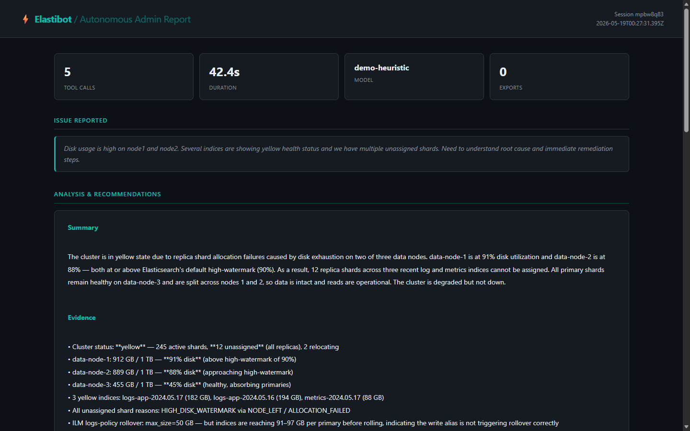

# ⚡ Elastibot

[](https://github.com/drdito/elastibot/actions/workflows/test.yml)

**Autonomous Elasticsearch Administration Harness**

A command-line agent that investigates Elasticsearch cluster issues end-to-end — from natural-language problem description to structured diagnosis, evidence tables, and exported reports. The LLM reasons about what to investigate next, picks one tool at a time, and either continues or concludes early once it has enough evidence to state a root cause and recommendations.

> Want to see it run without setting anything up? Try the live demo at **[danieldito.com](https://danieldito.com)** or run `node index.js --demo` after cloning.

---

## How it works

```
┌─────────────────────────────────────────────────────────────────┐
│                        ELASTIBOT PIPELINE                       │
│                                                                 │
│  Phase 1              Phase 2                    Phase 3        │
│  ─────────            ──────────────────         ──────────     │
│  Issue Intake    →    Investigation         →    Evidence &     │
│                       (incremental loop)         Exports        │
│                                                                 │
│  User describes       Each turn: model           HTML report    │
│  the problem          reasons, picks ONE         + CSV per      │
│  in plain text        tool, sees result,         tabular tool   │
│                       reasons again.             result         │
│                       Stops when it has                         │
│                       enough evidence.                          │
└─────────────────────────────────────────────────────────────────┘
```

The agent reveals its investigation one step at a time. Each turn the model streams its reasoning, then picks exactly one tool to call. After seeing the result it either continues or calls `conclude` — writing the final report as the argument and ending immediately.



*Generated HTML report from `--demo` mode.*

---

## Features

- **Model-agnostic** — works with any `/chat/completions`-compatible endpoint (OpenAI, Azure OpenAI, Ollama, vLLM, Anthropic-compatible proxies)
- **Unified ES/Kibana auth** — one API key in `.env` covers both services
- **Streaming output** — reasoning and token output stream live, with per-tool step markers and result banners interleaved
- **Incremental investigation** — the model picks one tool per turn, streams its reasoning before each choice, and calls `conclude` whenever it has enough evidence — no upfront plan that pre-supposes the answer
- **Configurable depth** — `--thinking-level N` (CLI) or `/thinking_level N` (prompt) caps the maximum number of investigation steps; the model can still conclude early
- **MCP-style tool registry** — 12 parameterized Elasticsearch API tools registered in a clean `{ name, description, parameters, execute }` contract
- **Agentic loop** — the executor runs one tool call per iteration, feeds results back into the message thread, and continues until `conclude` is called or the iteration cap is reached
- **Evidence exports** — HTML report (dark-theme, collapsible per-tool tables) and CSV files for every array result
- **Nearly dependency-free** — only `dotenv` and `inquirer`; all HTTP (including SSE streaming) handled with Node's native `https` module

---

## Project structure

```
elastibot/
├── index.js                    # Entry point: CLI harness, modes, orchestration
├── src/
│   ├── args.js                 # CLI argument helpers (--thinking-level)
│   ├── cli.js                  # ANSI rendering, spinner, phase headers
│   ├── llm.js                  # LLMClient — complete() and stream() over native https
│   ├── elastic.js              # ElasticClient — ApiKey auth over native https
│   ├── session.js              # Session state: messages, evidence, dag, exports
│   ├── planner.js              # parsePlan helper (used in tests; not called at runtime)
│   ├── executor.js             # Investigation loop: one tool per turn, early-exit via conclude
│   ├── demo.js                 # Demo mode: scripted reasoning + tool sequence, typewriter stream
│   ├── tools/
│   │   ├── registry.js         # Collects all tools; exports toolDefs + dispatch()
│   │   ├── cluster_health.js
│   │   ├── cat_indices.js
│   │   ├── cat_shards.js
│   │   ├── cat_allocation.js
│   │   ├── inspect_index.js
│   │   ├── index_settings.js
│   │   ├── query_statistics.js
│   │   ├── ilm_summary.js
│   │   ├── ilm_explain.js
│   │   ├── node_stats.js
│   │   ├── snapshot_status.js
│   │   └── pending_tasks.js
│   └── export/
│       ├── html.js             # Dark-theme HTML evidence report
│       └── csv.js              # CSV from any array-valued tool result
└── output/                     # Generated reports (gitignored)
```

---

## Prerequisites

- Node.js 18+
- An Elasticsearch cluster with an API key that has at least `monitor` cluster privilege
- Any OpenAI-compatible LLM endpoint

---

## Installation

```bash
git clone https://github.com/drdito/elastibot.git
cd elastibot
npm install
cp .env.example .env
# edit .env with your credentials
```

---

## Configuration

```env
# Elasticsearch / Kibana — shared API key
ES_URL=https://your-cluster.es.io:9200
ES_API_KEY=your_base64_encoded_api_key

# Kibana (optional, same key)
KIBANA_URL=https://your-cluster.kb.io:5601

# LLM — any OpenAI-compatible /chat/completions endpoint
LLM_BASE_URL=https://api.openai.com/v1
LLM_API_KEY=sk-...
LLM_MODEL=gpt-4o

# Output directory for generated reports
OUTPUT_DIR=./output

# Safety cap on agentic iterations (default 20)
MAX_ITERATIONS=20
```

Set `ES_TLS_VERIFY=false` for clusters with self-signed certificates.

Set `DEBUG=true` to print full stack traces on errors (useful during setup).

---

## Usage

### Try it without credentials (demo mode)

```bash
node index.js --demo
```

Runs through all three phases with scripted reasoning text and a simulated typewriter stream. Shows the full incremental investigation flow — reasoning before each tool choice, then an early `conclude`. Produces a real HTML report and CSVs in `./output`. No Elasticsearch cluster or LLM endpoint needed.

### Run against your cluster

```bash
npm start
```

Describe your issue at the prompt. The agent investigates incrementally and streams a full diagnosis.

**Controlling investigation depth:**

```bash
node index.js --thinking-level 5   # cap at 5 tool calls from the CLI
```

Or type `/thinking_level 5` at the issue prompt to set it interactively. The model can still conclude earlier if it has enough evidence.

**Example issues:**

- *"Disk usage is high on node1 and node2 and we have unassigned shards"*
- *"Indexing throughput dropped 60% in the last hour on the metrics-* indices"*
- *"Several ILM policies appear stuck — indices are not rolling over"*
- *"Cluster went yellow overnight, heap usage is elevated on all nodes"*

### Additional modes

```bash
node index.js --test       # Verify ES and LLM connectivity
node index.js --rollcall   # Live cluster snapshot: health, nodes, top indices by size
node index.js --tools      # List all 13 available tools with descriptions
```

---

## Available tools

| Tool | What it reveals |
|---|---|
| `cluster_health` | Status, shard counts, pending tasks |
| `cat_allocation` | Per-node disk usage — catches watermark breaches |
| `cat_indices` | Index health, size, doc count — sortable, filterable |
| `cat_shards` | Shard-level state and unassigned reasons |
| `inspect_index` | Deep stats: indexing/search rates, segment count, merge activity |
| `index_settings` | Replica count, refresh interval, ILM policy, codec |
| `query_statistics` | Query cache, fielddata, request cache hit/miss/eviction |
| `ilm_summary` | All ILM policies and their phase configurations |
| `ilm_explain` | Per-index ILM state, step errors, time in phase |
| `node_stats` | JVM heap, GC, thread pool queues, file system, CPU |
| `snapshot_status` | Repository list and snapshot state/size/errors |
| `pending_tasks` | Master node queue — catches cluster state update backlogs |
| `conclude` | Meta-tool called by the model to end the investigation and submit the final report |

---

## Adding a tool

Create `src/tools/your_tool.js`:

```js
module.exports = {
  name: 'your_tool',
  description: 'What this reveals and when to use it.',
  parameters: {
    type: 'object',
    properties: {
      index: { type: 'string', description: '...' },
    },
    required: ['index'],
  },
  async execute({ index }, elastic) {
    return elastic.get(`/${index}/_your_endpoint`);
  },
};
```

Then add one line to `src/tools/registry.js`:

```js
const yourTool = require('./your_tool');
const ALL_TOOLS = [ ..., yourTool ];
```

The tool is immediately available to the LLM on the next run.

---

## Technical notes

**Native HTTP only** — `src/llm.js` and `src/elastic.js` use Node's built-in `https`/`http` modules. SSE streaming from the LLM is parsed manually: newline-delimited `data:` frames are accumulated in a buffer, tool call arguments are concatenated across chunks by index, and `onToken`/`onToolStart` callbacks fire as content arrives.

**Incremental investigation** — There is no upfront planning phase. The executor runs a per-turn loop: each iteration the model streams its reasoning, then picks exactly one tool to call (one DAG step). After receiving the result it either calls another tool or calls `conclude` — passing the full final report as the argument — which ends the loop immediately. A hard `MAX_ITERATIONS` cap (default 20, overridable via `--thinking-level` or `/thinking_level N`) prevents runaway loops; when hit, the executor asks the model to call `conclude` with the evidence gathered so far.


**Tool call accumulation** — OpenAI-style streaming splits tool call names and JSON arguments across many SSE chunks. The client accumulates `{ id, name, arguments }` by delta index and fires `onToolStart` exactly once per tool, when the name first becomes non-empty.

**Session object** — Every run maintains a `Session` that holds the full OpenAI message array (system → user → assistant → tool → assistant…), evidence entries with timestamps, and export paths. The HTML report is generated directly from the session at the end, so it reflects exactly what the agent saw and did.

---

## Output

Each run produces timestamped files in `./output/`:

- `elastibot_<id>.html` — full dark-theme report with collapsible per-tool evidence tables, stat cards, the streamed analysis, and a risk assessment section
- `<tool>_<ts>.csv` — one CSV per tool that returned an array (e.g. `cat_indices`, `cat_allocation`, `cat_shards`)

---

## Origin

This is a public portfolio analog of a tool I built and deployed in a professional context. The architecture, agentic loop, and tool-registry pattern reflect the real implementation; data, credentials, and client-specific context have been replaced.

---

## License

MIT
